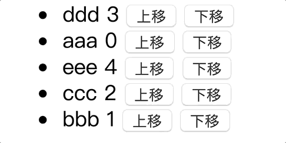

# 用原生js实现\<li>元素上移下移的三种方法
这个小题目是我在[妙味课堂的DOM课程](https://study.miaov.com/study/show/chapter/69)的练习中看到的，老师出题的本意应该是让大家练习各种DOM API的使用。我按照三种思路实现了三个版本。对定位版的实现仍有些疑问，大家如果有什么不同见解欢迎提issue。

## 需求描述
给定一个无序列表结构，要求实现如下的效果：

1. 每个\<li>都支持“上移”和“下移”两种操作，通过点击元素后面的按钮触发。
2. 若某次点击的元素不会移出边界，则交换该元素和相邻的指定方向的元素。
3. 若某次即将“溢出”边界，则应实现“循环”移动的效果。
4. 移动时最好有动画

## 思路分析
如果要求只是改变了元素在视觉上的顺序就可以，那么底层我们可以通过多种改变方式来实现，我想出了如下三种思路。
1. 改变数据的顺序：把\<li>序列映射为数组，在数据层面上更新。具体地，利用数组的`push`, `pop`, `shift`, `unshift`, `splice`方法改变数组内元素的顺序，然后重新渲染\<li>序列。感觉这种做法有点MVVM的意思了，只是我在view的更新上还比较蛮力。我最先想到的是这个方法。

2. 改变html结构的顺序：获取到\<li>元素序列，在html结构层面上更新。具体地，利用DOM的`node.children`, `node.insertBefore`, `node.appendChild`等API对\<li>元素做剪切和粘贴操作。

3. 改变样式：给元素absolute定位，并通过top值区分元素的位置。给top属性加transition可实现动画。

## 实现代码
三个实现通用的结构如下
````html
<div id="app">
    <ul id="ul">
    </ul>
</div>
````
对于第三种方法，需要给li添加定位，以及动画
````css
li {
    position: absolute;
    transition: 1s top;
}
````

三个版本通用的脚本如下
````javascript
const ul = document.getElementById('ul');
const STEP = 20; // 每个li的top之间的间隔
const tops = [0, 20, 40, 60, 80];
// 以id判别相等
const data = ['aaa', 'bbb', 'ccc', 'ddd', 'eee'].map((d, index) => {
    return {value: d, id: index};
});
// 把data数组映射为<li>字符串
function buildLis(data) {
    return data.map((datum, index) => {
        return `<li id=${datum.id} style="top:${index * 20}px">
            <span>${datum.value}</span> <span>${datum.id}</span>
            <input type="button" class="up" value="上移"/>
            <input type="button" class="down" value="下移"/>
        </li>`;
    });
}
ul.innerHTML = buildLis(data).join('');
// 这里用了事件代理。input -> li -> ul
ul.onclick = (event) => {
    const value = event.target.classList.value;
    if (value === 'up' || value === 'down') {
        // change(event.target.parentNode, value);
        // change2(event.target.parentNode, value);
        change3(event.target.parentNode, value);
    }
}
````

以下三个版本的change函数的实现分别对应上述三种思路。
### 数据驱动版
````javascript
/**
 * 数据驱动版
 * @description: 
 * @li {HTMLElement} 触发点击事件的li 
 * @direction {'up' | 'down'} 移动方向 
 * 
 * 优点：改变数据的顺序，然后重新渲染，逻辑简单
 * 缺点：每次改变都要重新渲染整个ul；难实现动画
*/
function change(li, direction) {
    const id = Number(li.id);
    const index = data.findIndex((datum) => datum.id === id);
    if (direction === 'up' && index === 0) { // 最上面的元素上移，变到末尾
        data.push(data.shift());
    } else if (direction === 'down' && index === data.length - 1) { // 最下面的元素下移，变到开头
        data.unshift(data.pop());
    } else if (direction === 'up') { // 非最上面的元素上移，交换它和它上一个元素
        const prev = data[index - 1];
        const cur = data[index];
        data.splice(index - 1, 2, cur, prev);
    } else if (direction === 'down') { // 最最下面的元素下移，交换它和它下一个元素
        const next = data[index + 1];
        const cur = data[index];
        data.splice(index, 2, next, cur);
    }
    // 重新渲染所有li
    ul.innerHTML = buildLis(data).join('');
}
````

### dom元素剪切版
````javascript
/**
 * 直接操作dom版
 * @description: 
 * @li {HTMLElement} 触发点击事件的li 
 * @direction {'up' | 'down'} 移动方向 
 * 
 * 优点：利用dom剪切api，实现简单。
 * 缺点：难加动画；每次都会改变html结构
*/
function change2(li, direction) {
    const lis = Array.from(li.parentNode.children);
    const index = lis.findIndex(item => item.id === li.id);
    if (direction === 'up' && index === 0) { // 最上面的元素上移，变到末尾
        ul.appendChild(li);
    } else if (direction === 'down' && index === data.length - 1) { // 最下面的元素下移，变到开头
        ul.insertBefore(li, lis[0]);
    } else if (direction === 'up') { // 非最上面的元素上移，交换它和它上一个元素
        ul.insertBefore(li, lis[index - 1]);
    } else if (direction === 'down') { // 最最下面的元素下移，交换它和它下一个元素
        ul.insertBefore(lis[index + 1], li);
    }
}
````

### 改变样式版

````javascript
/**
 * 改变样式版
 * @description: 通过绝对定位，改变top值实现元素交换时的动画
 * @li {HTMLElement} 触发点击事件的li 
 * @direction {'up' | 'down'} 移动方向 
 * 
 * 优点：有动画，不剪切li，每次只改变需要改变的li的top
 * 缺点：html结构上永远和初始时一样，html结构不再能反映当前的样式上的情况；需要绝对定位
 */
function change3(li, direction) {
    // 为了增加动画，元素的排列顺序不再与样式上的顺序相关。
    const oldTop = parseInt(li.style.top);
    const lis = Array.from(li.parentNode.children);
    if (direction === 'up'&& oldTop === tops[0]) { // 最上面的元素上移，跟末尾的元素调换，所有其他元素都上移
        lis.forEach(item => item.style.top = parseInt(item.style.top) - STEP + 'px');
        li.style.top = tops[lis.length - 1] + 'px'; //目标元素移到最底部
    } else if (direction === 'down' && oldTop === tops[lis.length - 1]) { // 最下面的元素下移，变到开头
        lis.forEach(item => item.style.top = parseInt(item.style.top) + STEP + 'px');
        li.style.top = tops[0] + 'px';
    } else { // 只需局部两个元素互换
        const thatLiTop = parseInt(li.style.top) + (direction === 'up' ? -STEP : STEP) + 'px';
        const thatLi = lis.find(item => item.style.top === thatLiTop);
        thatLi.style.top = li.style.top; // 交换
        li.style.top = thatLiTop;
    }
}
````
三个思路中，第一个应该是在使用一些MVVM框架的项目中最常用到的吧。第二个就是直接和dom打交道了，需要注意减少reflow。

第三个属于我为了实现切换动画另外想的，动画虽然实现了，但我发现html中\<li>的顺序从上到下和视觉上元素的顺序不再对应了。html中的顺序一直没有变过，变的只是样式。这种方法我觉得对于数据的组织来说不够友好，如果需要按照当前视觉上的顺序遍历元素，那么复杂度就不再是O(n)的了，需要先按样式排个序才行。

我好奇有没有什么方法可以既保证改变html中元素的顺序，又能有动画效果的。我尝试过在第三种方法的基础上，向下面这样排序后重新插入\<li>序列，但动画就消失了。
````javascript
//这样可以保持结构和样式的顺序一致，但是没有动画了。
lis.sort((lia, lib) => parseInt(lia.style.top) - parseInt(lib.style.top));
// remove all children first
while (ul.firstChild) {
    ul.removeChild(ul.firstChild);
}
// 再按照排好的顺序插回来
lis.forEach(item => {
    ul.appendChild(item);
})
````
阅读到这里的你，如果有什么想法，欢迎提issue
